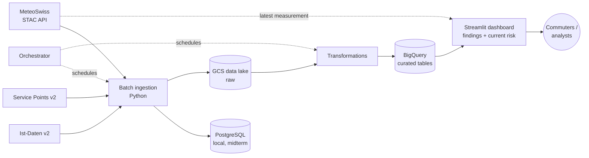

# Weather Impact on Rail Punctuality in the Canton of Lucerne

**DENG HS26 – Data Engineering Project, Hochschule Luzern** \
Team · _Emre Sen_ · _Theodora Haimoff_

**In short:** a batch pipeline that joins actual train operations data with official
MeteoSwiss weather measurements for the canton of Lucerne, and a **Streamlit dashboard**
where commuters can explore our findings and check the **current delay and cancellation
risk** for their station based on today's weather.

---

## 1. Problem and use case

Train delays and cancellations are more frequent in bad weather, but commuters have no
concrete answer to questions like:

- *"What is the chance my train in the canton of Lucerne is late when it rains or snows, and by how much?"*
- *"How severe does the weather have to be before trains get cancelled?"*

This project builds an end-to-end batch data pipeline that combines **actual train
operations data** with **official MeteoSwiss weather measurements**, classifies the weather
by type and severity, and produces curated tables that answer these questions. The results
are made available to users through a **Streamlit dashboard** with two views:

- **Findings:** how delays and cancellations change with weather type and severity, compared with calm/dry weather, and which stations and lines are most affected.
- **Current risk:** the user selects their station, the dashboard fetches the latest MeteoSwiss measurement, classifies it, and shows the historical probability and typical size of a delay or cancellation under these conditions.

**Intended users**

| User | Need |
|---|---|
| Commuters in the canton of Lucerne (primary) | Check in the dashboard how likely their train is to be delayed or cancelled given the current weather |
| Analysts / regional transport planners (secondary) | Explore in the dashboard (or query directly) which lines and stations are most weather-sensitive |

**Data product:**

1. **Streamlit dashboard** (user-facing) with the findings and current-risk views described above.
2. **Curated analytical tables** in BigQuery (final solution) that feed the dashboard: delay
   distributions and cancellation rates per weather type, severity level, station, line and
   time of day, compared against a calm/dry-weather baseline.

**Important caveat:** delays and cancellations have many causes (technical faults, staff
issues, accidents, personal injuries). The data contains no cause information, so results
are **correlations and conditional probabilities, not causal effects**. See
[docs/use_case.md](docs/use_case.md).

## 2. Scope

| Dimension | Scope |
|---|---|
| Transport mode | Rail only (`PRODUKT_ID = Zug`) |
| Region | Stops located in the canton of Lucerne |
| Period | From July 2025 (Ist-Daten v2) onwards |
| Weather granularity | Hourly |
| Weather types | Rain, wind, heat, frost (measured); snow, thunderstorms, icy conditions (derived) |

Buses, trams and boats are excluded to keep the project focused and to avoid operators
with incomplete real-time data. Rail completeness is verified by a profiling step
(see [docs/data_sources.md](docs/data_sources.md)).

## 3. Data sources

| Source | Content | Access | Update |
|---|---|---|---|
| [opentransportdata.swiss – Ist-Daten v2](https://data.opentransportdata.swiss/dataset/ist-daten-v2) | Scheduled vs. actual arrival/departure times, cancellations, per stop event | Daily CSV download; monthly ZIP [archive](https://archive.opentransportdata.swiss/) for backfills | Daily (previous operating day) |
| [opentransportdata.swiss – Service Points v2](https://data.opentransportdata.swiss/dataset/service-point-v2) | Stop master data incl. WGS84 coordinates, used for the canton filter and weather-station mapping ([cookbook](https://opentransportdata.swiss/en/cookbook/masterdata-cookbook/servicepoints/)) | CSV download | Daily ("today" version) |
| [MeteoSwiss Open Data – SwissMetNet](https://opendatadocs.meteoswiss.ch/a-data-groundbased/a1-automatic-weather-stations) | Hourly precipitation, temperature, wind gusts, etc. per station | STAC API (`data.geo.admin.ch`), CSV per station | Hourly / daily / yearly files |

Details (schema, volume, quality risks): [docs/data_sources.md](docs/data_sources.md)

## 4. Architecture (v0.1)



Full description, ingestion strategy and division of responsibilities:
[docs/architecture/architecture_v0.1.md](docs/architecture/architecture_v0.1.md)

## 5. Repository structure

```
.
├── README.md
├── docs/
│   ├── use_case.md                 # problem, users, questions, data product
│   ├── data_sources.md             # provenance, schema, volume, quality risks
│   ├── project_plan.md             # milestones and backlog
│   └── architecture/
│       └── architecture_v0.1.md    # initial architecture and responsibilities
├── ingestion/                      # batch ingestion scripts (planned)
├── orchestration/                  # orchestrator flows (planned)
├── transformations/                # SQL / transformation models (planned)
├── terraform/                      # GCP infrastructure (planned, final)
├── dashboard/                      # Streamlit dashboard (planned, final)
└── data/                           # local data – not committed
```

## 6. Setup and execution

_To be completed for the midterm._ Planned: Docker Compose environment with PostgreSQL
and the orchestrator; credentials via `.env` (an `.env.example` will be provided; secrets
are never committed).

## 7. Project plan

See [docs/project_plan.md](docs/project_plan.md).

## 8. Known risks and limitations (initial)

- No cause-of-delay information; results are correlational.
- Journeys without real-time data are missing entirely from Ist-Daten.
- Automatic snow-depth measurements are not quality-checked by MeteoSwiss; snow is derived from precipitation and temperature.
- Thunderstorms and icy conditions are not measured directly and are approximated.
- Weather is measured at a few stations and may not represent conditions at every stop.
- The dashboard's "current risk" is not a live train-delay prediction: it combines the latest weather measurement with historical probabilities computed by the batch pipeline.

## 9. Data attribution

- Transport data: Open Data Platform Mobility Switzerland (opentransportdata.swiss).
- Weather data: MeteoSwiss.