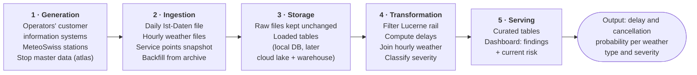
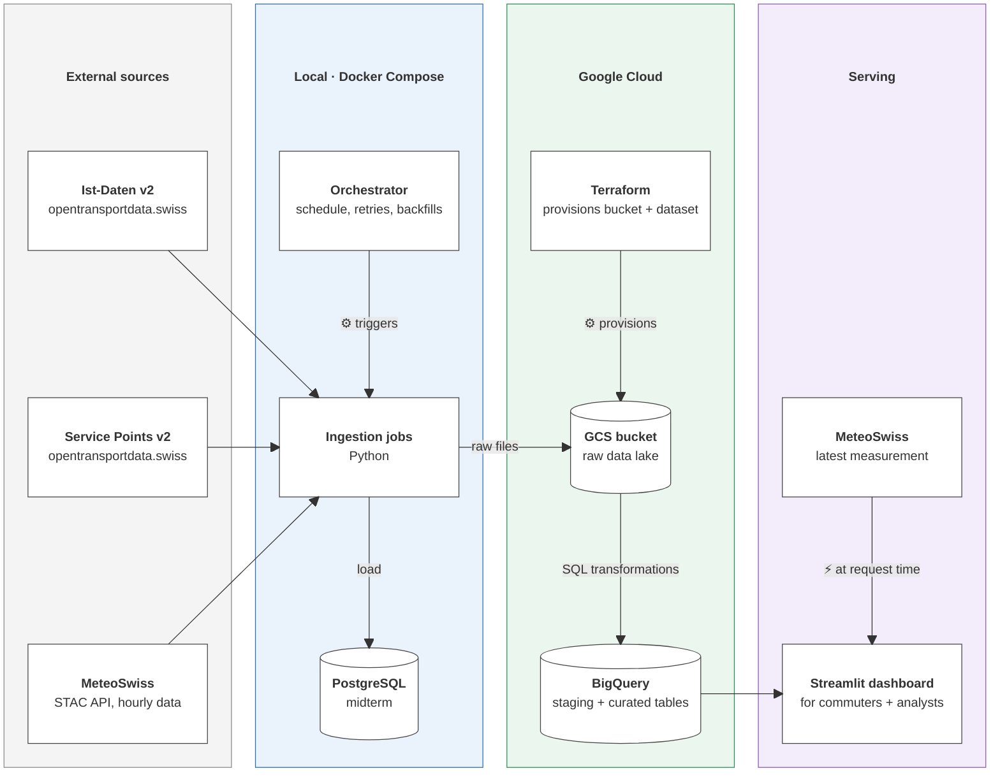

# Architecture v0.1

_Initial architecture for Milestone 1. Decisions marked **(open)** will be revisited in
Architecture v0.2 (midterm)._

## 1. Data engineering lifecycle

The pipeline follows the data engineering lifecycle from the lecture: generation →
ingestion → storage → transformation → serving.

For each stage: what happens, where the data lives, and what can go wrong.

| Stage | What happens | Where it lives | What can go wrong |
|---|---|---|---|
| **Generation** | Operators' customer information systems record scheduled and actual times per stop; MeteoSwiss stations measure weather; atlas maintains stop master data | Source systems, published by opentransportdata.swiss and MeteoSwiss (not controlled by us) | Missing real-time data (journeys absent), forecast values instead of actual times, sensor outages, schema changes (e.g. Ist-Daten v1 → v2) |
| **Ingestion** | Python downloads one Ist-Daten file per operating day, hourly weather files per station, and the service-points file | Source websites / STAC API → raw storage | File not yet published, failed download, changed columns, too-frequent requests to MeteoSwiss (terms of use) |
| **Storage** | Keep raw files unchanged; load the relevant rows into tables | Midterm: PostgreSQL on a Docker volume. Final: GCS (raw) + BigQuery | Partial loads, duplicates after reruns, lost local volume |
| **Transformation** | Filter to Lucerne rail (join with the stop list); parse dates/times; derive stop role; compute arrival and departure delays; map stops to weather stations; align time zones; classify weather severity; aggregate | SQL tables/views in PostgreSQL (midterm), BigQuery (final) | Wrong join (time zone/DST), wrong thresholds, misleading rates from few observations |
| **Serving** | Curated tables and the Streamlit dashboard answer the user questions | BigQuery curated tables → Streamlit | Stale data, results shown without context (baseline, number of observations) |

## 2. Architecture (components)

Which systems we use, where they run, and how data moves between them.

**Legend:** unmarked arrows = data flow (batch) · ⚙ = control (the orchestrator starts jobs, Terraform provisions resources) · ⚡ = live call at request time

- **External sources** are consumed, not controlled: we only read their published files.
- **Local (Docker Compose):** the orchestrator schedules the ingestion jobs (and later the
  transformations) and handles retries and backfills. For the midterm, data is loaded into
  PostgreSQL and the first transformation runs there.
- **Google Cloud (final):** the GCS bucket and BigQuery dataset are provisioned with
  Terraform (run from our machines; shown in the cloud column because it defines those
  resources). Raw files go to GCS; SQL transformations produce staging and curated tables in
  BigQuery.
- **Serving:** the Streamlit dashboard (run as a container, used by commuters and analysts)
  queries the curated tables and,
  for the current-risk view, fetches the latest MeteoSwiss measurement at request time.

## Storage decisions by workload

Storage is chosen by workload, not by familiarity. The technologies below are the ones
required by the project description; the table explains why each fits its workload.

| Workload | What matters most | Storage | Data temperature |
|---|---|---|---|
| Raw source files (daily Ist-Daten, weather files, service points) | Cheap, durable, keep everything for reprocessing and backfills | Object storage: GCS (final); local files only for development | Cold: read again only for reruns/backfills |
| Curated and aggregated tables | Efficient repeatable SQL and aggregations | Warehouse: BigQuery (final); PostgreSQL for the smaller local setup (midterm) | Hot: queried by the dashboard |
| Live events | – | Not needed: sources publish daily/hourly files, so daily batch is sufficient. A streaming platform would add cost and complexity without benefit | – |

In the final solution, storage (GCS, BigQuery storage) and compute (BigQuery queries,
pipeline runs) are separated: raw data stays in cheap storage, and compute is only used
when the pipeline runs or the dashboard queries.

## Reliability considerations

| Concept | In this project | Design decision |
|---|---|---|
| SLA / freshness | The dashboard should show data up to the previous operating day each morning (exact time depends on when Ist-Daten is published **(to verify)**) | Daily scheduled run with retries; freshness timestamp shown in the dashboard |
| Scalability | The national Ist-Daten file is large, but only a small part is Lucerne rail; history grows every day | Filter early for the curated tables; partition by operating day; keep raw files in object storage |
| Schema evolution | Ist-Daten v1 was replaced by v2; service points moved to v2; MeteoSwiss may add parameters | Only v2 from July 2025; explicit column selection and validation at ingestion so unexpected changes fail loudly instead of silently |
| Metadata and discovery | Users must know what "delay", "severe rain" or a station mapping means | Data dictionary and documented thresholds in the repository; lineage columns (source file, ingestion time) in every table |

## Technology overview

Technologies marked (required) are prescribed by the project description; the others are
our choice and are justified where they are used.

| Component | Midterm (local) | Final (cloud) |
|---|---|---|
| Ingestion | Python scripts, one module per source | Same scripts, writing to GCS |
| Storage | PostgreSQL in Docker (required) | GCS bucket + BigQuery dataset (required) |
| Transformation | SQL in PostgreSQL (at least one justified transformation) | SQL in BigQuery; a transformation framework only if introduced in the course **(open)** |
| Orchestration | Workflow orchestrator in Docker Compose (required; **tool not yet chosen** – will follow the tool introduced in the course) | Same orchestrator, extended to cloud tasks |
| Infrastructure | Docker Compose, shared network (required) | Terraform for GCS bucket and BigQuery dataset (required) |
| Presentation | – | Streamlit dashboard reading curated BigQuery tables, run as a container in Docker Compose **(hosting open)** |
| Secrets | `.env` (not committed), `.env.example` provided | Service-account key / env variables, never committed |

## Ingestion strategy

### Transport (Ist-Daten v2)

- **Incremental, one operating day per run.** A new file is published daily for the previous day, so the natural unit of work is one day.
- **Backfill** from the monthly ZIP archive for historical months (from July 2025).
- **Idempotent reruns:** loading a day replaces all data for that day (delete-and-insert / partition overwrite), so a rerun never creates duplicates.
- **Filtering by join:** rows are kept if `PRODUKT_ID = 'Zug'` and `BPUIC` matches a stop in `dim_station`, so no stop list is hard-coded. Midterm: filtered during ingestion to keep PostgreSQL small. Final: the raw file stays unchanged in GCS and the join happens in the BigQuery transformation.
- **Dependency:** the stop list must be loaded before the Ist-Daten, otherwise the join finds no stops. The orchestrator enforces this order.
- **Failure behaviour:** retries with backoff for download errors; a missing file (not yet published) fails the run for that day, which can be rerun later.

### Weather (MeteoSwiss)

- **Station metadata first:** `ogd-smn_meta_stations.csv` is loaded to build the stop-to-station mapping (nearest station within 300 m altitude difference, see [data sources](../data_sources.md)).
- **Historical file loaded once** per mapped station (covers until the end of last year; reloaded when MeteoSwiss publishes the new yearly file); **recent file loaded daily** (current year until yesterday).
- Reruns overwrite the affected hours, so corrected values from MeteoSwiss replace older ones.
- Only five stations are loaded, so volume is not a concern.

### Stop metadata (Service Points v2)

- Full reload of `actual-date-swiss-service-point.csv` (small reference table), run weekly or on demand.
- The filters are applied in code (`cantonAbbreviation = 'LU'`, `stopPoint`, `hasGeolocation`, `meansOfTransport` contains `TRAIN`); the result (51 stops during exploration) is checked on every run.

### Final solution: cloud ingestion path

In line with the project requirements, the production path downloads from the source and
writes **directly to GCS**, without depending on local storage in between. Local files
are only used for development and testing.

## Planned data model (first draft)

- `fact_stop_event` – one train stop event, with stop role (origin / terminus / intermediate), arrival and departure delay (from `REAL` times only), cancellation flag and weather of the matching hour
- `dim_station` – one rail stop in the canton, with its assigned weather station, distance and altitude difference; optionally the share of origin/terminus events (e.g. ~100 % for Luzern)
- `dim_weather_hour` – one weather station × hour, with measurements and severity levels
- `agg_weather_punctuality` – aggregated delay/cancellation metrics per weather type × severity × station × hour of day

Partitioning (e.g. by operating day) and clustering (e.g. by station, weather type) will be
decided for the final milestone based on the expected query patterns.

## Dashboard

- Reads only the curated/aggregated BigQuery tables (small, fast queries; no raw data).
- **Current risk:** fetches the latest MeteoSwiss measurement for the selected station's weather station at request time, classifies it with the same severity logic as the pipeline (shared Python module, so thresholds are defined in one place), and looks up the matching historical probability.
- Query results are cached to limit BigQuery cost.
- If the current measurement is unavailable, the dashboard falls back to a manual weather selection.

## Division of responsibilities

| Area | Lead | Support |
|---|---|---|
| Transport ingestion (Ist-Daten, archive backfill, Lucerne rail filter) | Emre Sen | Theodora Haimoff |
| Stop metadata (Service Points v2) and stop-to-weather-station mapping | Emre Sen | Theodora Haimoff |
| Weather ingestion (STAC API, stations, parameters) | Theodora Haimoff | Emre Sen |
| Weather type and severity classification | Theodora Haimoff | Emre Sen |
| Docker Compose and PostgreSQL | Emre Sen | Theodora Haimoff |
| Orchestration (schedules, retries, backfills) | Theodora Haimoff | Emre Sen |
| Transformations and data model | Shared | – |
| Terraform and GCP setup (final) | Shared | – |
| Streamlit dashboard | Shared | – |
| Documentation and architecture updates | Shared | – |

**Way of working:** each member pushes their work directly to the main branch every week.
The other member then reviews the pushed changes (reading the code and running it locally)
and gives feedback, so that both understand the complete architecture, as required for the
oral defences. Commit messages follow the Conventional Commits convention (see
[CONTRIBUTING.md](../../CONTRIBUTING.md)), so contributions stay traceable in the Git history.

## Open decisions

- Orchestrator tool (to be aligned with the course).
- Transformation tooling in the cloud (plain BigQuery SQL unless the course introduces a framework).
- Exact delay threshold and severity thresholds.
- Weather stations: five stations chosen by the mapping (LUZ, EGO, MOA, SPF, CHZ); still to confirm with the complete data inventory that each measures all needed parameters.
- Dashboard hosting (local container only vs. a hosted deployment).
