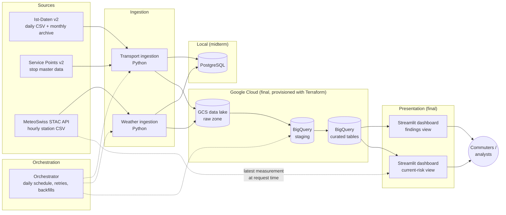

# Architecture v0.1

_Initial architecture for Milestone 1. Decisions marked **(open)** will be revisited in
Architecture v0.2 (midterm)._

## Overview

## Components

| Component | Midterm (local) | Final (cloud) |
|---|---|---|
| Ingestion | Python scripts, one module per source | Same scripts, writing to GCS |
| Storage | PostgreSQL in Docker | GCS bucket (raw data lake) + BigQuery dataset |
| Transformation | SQL in PostgreSQL (at least one justified transformation) | SQL / dbt in BigQuery **(open)** |
| Orchestration | Orchestrator in Docker Compose **(tool open, e.g. Kestra or Airflow)** | Same orchestrator, extended to cloud tasks |
| Infrastructure | Docker Compose, shared network | Terraform for GCS bucket and BigQuery dataset |
| Presentation | – | Streamlit dashboard reading curated BigQuery tables, run as a container in Docker Compose **(hosting open)** |
| Secrets | `.env` (not committed), `.env.example` provided | Service-account key / env variables, never committed |

## Ingestion strategy

### Transport (Ist-Daten v2)

- **Incremental, one operating day per run.** A new file is published daily for the previous day, so the natural unit of work is one day.
- **Backfill** from the monthly ZIP archive for historical months (from July 2025).
- **Idempotent reruns:** loading a day replaces all data for that day (delete-and-insert / partition overwrite), so a rerun never creates duplicates.
- **Early filtering** (rail, Lucerne stops) for the local database to keep it small. The raw file is kept unchanged in the data lake in the final solution.
- **Failure behaviour:** retries with backoff for download errors; a missing file (not yet published) fails the run for that day, which can be rerun later.

### Weather (MeteoSwiss)

- **Historical file loaded once** per station (full load); **recent file loaded daily** (incremental).
- Reruns overwrite the affected hours, so corrected values from MeteoSwiss replace older ones.
- Only a few stations are loaded, so volume is not a concern.

### Stop metadata (Service Points v2)

- Full reload of the "today" file (small reference table), run weekly or on demand; only Lucerne rail stops are kept for the mapping.

### Final solution: cloud ingestion path

In line with the project requirements, the production path downloads from the source and
writes **directly to GCS**, without depending on local storage in between. Local files
are only used for development and testing.

## Planned data model (first draft)

- `fact_stop_event` – one train stop event, with delay, cancellation flag and weather of the matching hour
- `dim_station` – one rail stop in the canton, with its assigned weather station
- `dim_weather_hour` – one weather station × hour, with measurements and severity levels
- `agg_weather_punctuality` – aggregated delay/cancellation metrics per weather type × severity × station × hour of day

Partitioning (e.g. by operating day) and clustering (e.g. by station, weather type) will be
decided for the final milestone based on the expected query patterns.

## Dashboard

- Reads only the curated/aggregated BigQuery tables (small, fast queries; no raw data).
- **Current risk:** fetches the latest MeteoSwiss measurement for the selected station's weather station at request time, classifies it with the same severity logic as the pipeline (shared Python module, so thresholds are defined in one place), and looks up the matching historical probability.
- Query results are cached to limit BigQuery cost.
- If the current measurement is unavailable, the dashboard falls back to a manual weather selection.

## Division of responsibilities

| Area | Lead | Support |
|---|---|---|
| Transport ingestion (Ist-Daten, archive backfill, Lucerne rail filter) | Emre Sen | Theodora Haimoff |
| Stop metadata (Service Points v2) and stop-to-weather-station mapping | Emre Sen | Theodora Haimoff |
| Weather ingestion (STAC API, stations, parameters) | Theodora Haimoff | Emre Sen |
| Weather type and severity classification | Theodora Haimoff | Emre Sen |
| Docker Compose and PostgreSQL | Emre Sen | Theodora Haimoff |
| Orchestration (schedules, retries, backfills) | Theodora Haimoff | Emre Sen |
| Transformations and data model | Shared | – |
| Terraform and GCP setup (final) | Shared | – |
| Streamlit dashboard | Shared | – |
| Documentation and architecture updates | Shared | – |

Both team members review each other's pull requests so that both understand the complete
architecture, as required for the oral defences.

## Open decisions

- Orchestrator choice (e.g. Kestra vs. Airflow).
- Transformation tool in the cloud (plain BigQuery SQL vs. dbt).
- Exact delay threshold and severity thresholds.
- Final weather stations after checking coverage and data availability.
- Dashboard hosting (local container only vs. a hosted deployment).
